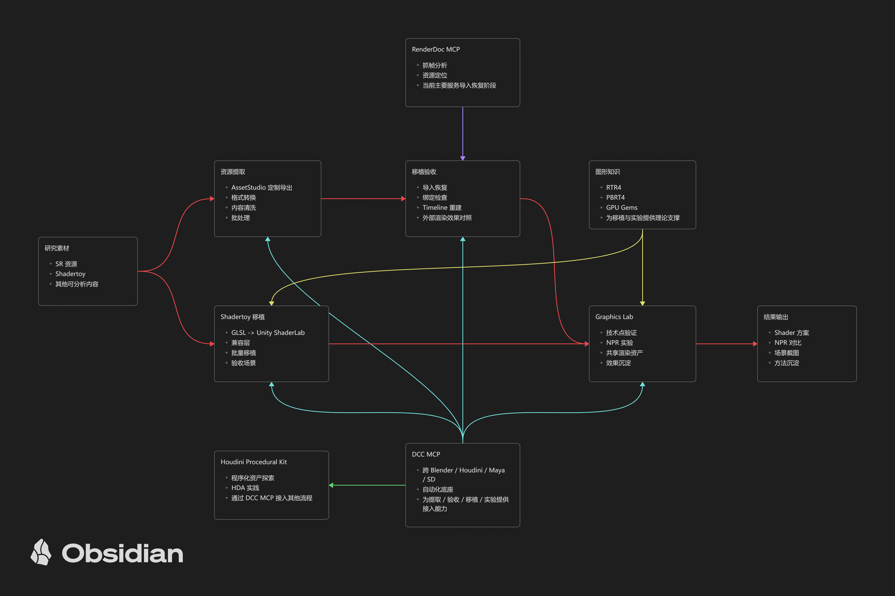

# WhiteLeer

聚焦实时图形、Unity 工具链、DCC 自动化与资产处理工作流。

## 技术链

## 当前主要仓库

### 图形、渲染与验收

- [`unity-graphics-lab`](https://github.com/WhiteLeer/unity-graphics-lab)
  - Unity 图形实验场：渲染算法验证、共享预览系统与工程化示例。
- [`unity-shadertoy-validation`](https://github.com/WhiteLeer/unity-shadertoy-validation)
  - Shadertoy 参考提取、Unity 移植、效果对照与可复现验收。
- [`unity-extraction-validation`](https://github.com/WhiteLeer/unity-extraction-validation)
  - Unity 资源提取后的导入恢复、材质与绑定检查、角色规范化及内容验证。

### 图形调试与工具

- [`my-renderdoc`](https://github.com/WhiteLeer/my-renderdoc)
  - Personal RenderDoc baseline with game-version-specific branches.

### 资产与内容工作区

- [`my-assets-studio`](https://github.com/WhiteLeer/my-assets-studio)
  - AnimeStudio 上游基线镜像；资源提取与游戏适配在独立分支维护。

### 图形知识

- [`graphics-reading-notes`](https://github.com/WhiteLeer/graphics-reading-notes)
  - RTR4、PBRT4 与 GPU Gems 系列图形学笔记的统一归档。

## 说明

- 本仓库是公开项目导航，不代替各项目自己的文档。
- 私有仓库用于资产研究工作区、每日记录与长期知识沉淀，不在公开主页逐项展示。
- `github-metrics.svg` 由 `.github/workflows/metrics.yml` 自动更新。
